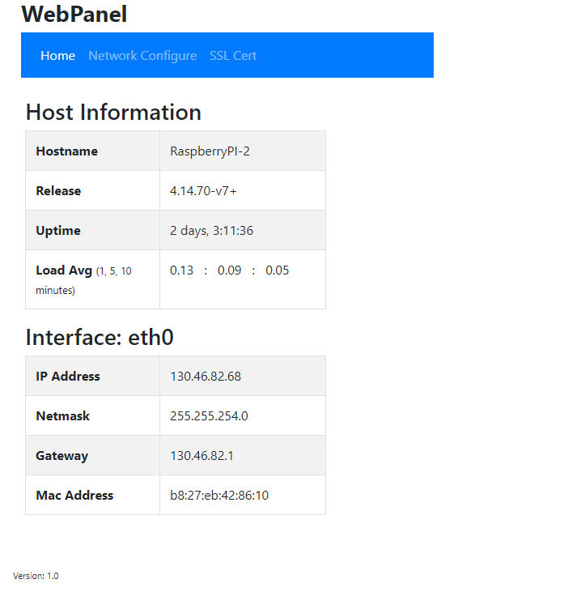
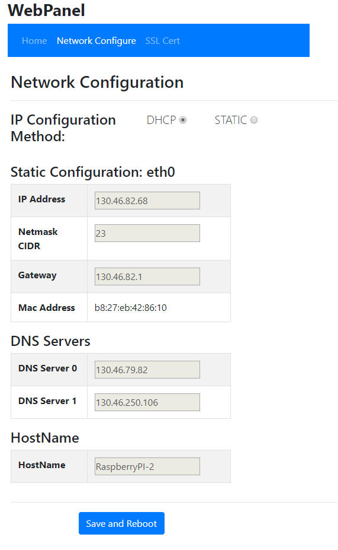
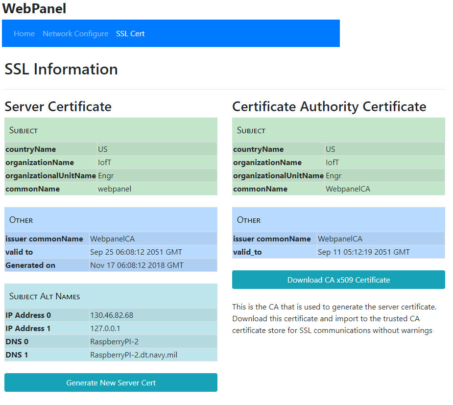

# webpanel

Provide generic web interface to facilitate setting network and related parameters for embedded linux and creating and installing a self-signed certificate.

# Screen Shots

---

---

# SSL Configuration

Cert generation happens in the ./cert directory. After a fresh install
run these two command line scripts in the ./cert directory to generate a
Certificate Authority (CA) cert and server cert:

>cd ./cert  
>./create_CA_cert.py  
>./create_server_cert.py  

Edit the Certificate Authority ini file (opensslCA.ini) for custom
parameters if desired before running create_CA_cert.py. After running
these two scripts the following files should be created:

* webpanelCA.crt
* webpanelCA.key
* webpanel.crt
* webpanel.csr
* webpanel.key

After creating these files reboot (or systemctl restart nginx) to restart
nginx which requires the webpanel.crt and webpanel.key files as specified
in the webpanel nginx conf file.

This CA cert is downloadable on the sslcert page. Install this cert in
the trusted certificate store of the client system to complete ssl setup
and you should have warning-free ssl access.

You can generate a new server cert from the sslcert page at any time
which will be necessary if the IP address is changed.

Certificates are v3 x509 certs.

# Authentication

User Names and Passwords are stored in an Apache style htpasswd file.
Presently there is not web forms to CRUD user/passwords. A TBD. The
htpasswd file can be managed via the htpasswd file on the command line.
Default credentials is user/pass = root/root

Authentication uses a session cookie and obviously only makes sense in
a ssl environment.

Any callback that you want to add and want to protect it with a login
just add at beginning of the callback:

self.auth.authorize()

# Templates

HTML templates can be found in ./templates and customer override templates
in ./template_cust. The search priority path is:

./template_cust
./tempates

The template class looks in the search path and stops after finding the first named
template. The base layout template is in template_cust as an example

System templates can be found in ./templates_cust or in /etc. The search priority is:

./etc
./templates_sys

The rendered system templates have hints of the source of the template used.

# Misc config file notes:

## Filesystem read only 'ro' and read write 'rw' mode.

All file writes and files system actions are handled by commonutils.py.

If the status of the root file system at start up is 'ro' then all changes
to the file system will change the status to 'rw' mode and then back to 'ro'
mode when done.

If the status of the root files system at start is 'rw' then all changes
will leave the file system in 'rw'. This is useful for development.

## NGINX

An example nginx config file is given in the setup directory. nginx
provides for ssl (as cherrypy ssl implimentation is broken) and allows
you to integrate other apps.

The NGINX unit-file (/lib/systemctl/system/nginx.service) has a modification

ExecStartPre=/bin/mkdir -p /var/log/nginx

Without this addition nginx will not start. See nginx unit-file in ./setup/unit-files

A sample nginx configuration files can be found here ./setup/nginx/webpanel.conf

## unit-files

Example unit-files are in the setup directory. Note that unit files
are configured to restart if app quits. This means that to run on the
command line you have stop the service and then run from from the command
line. That is:

>systemctl stop webpanel
>cd /opt/webpanel
>./webpanel.py

Also the unit file runs the webpanel in quiet mode -q.

## DEV_MODE

If a file DEV_MODE exists in webpanel directory then template renders
will include the source of the templates in the output.

## Command line Options

-q  Runs in production mode. Most notably it turns off autoreload which is a
resource hog and turns off stdout to console.

# Dependencies

Python3

Python Modules

pip3 install distro
pip3 install netifaces
pip3 install netaddr
pip3 install cryptography
pip3 install TemplateRex
pip3 install platform

Linux modules

apt-get install dhcpcd5
apt-get install apache2-utils  # <--- htpasswd utility

apt-get remove conmann
